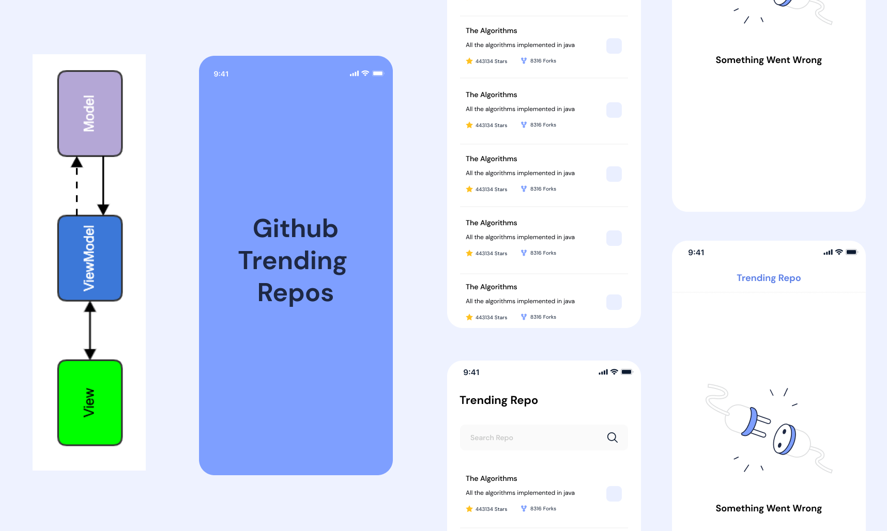

**Github Trending Repo** is an Android application 📱 built using *Modern Android development*

[[Click Here to Download APK]](https://github.com/nishantsharma1115/Github-Trending-Repos/releases/tag/release/TrendingRepo.apk)

## About

- It simply loads **Github Trending Repositories** from [API](https://docs.github.com/en/rest/reference/search#search-repositories).
- You can select repo by simply clicking on it.
- The selection will survive the configuration changes.
- You can search trending repos from local list.
- It is offline capable (Using Cache) 😃.

## 🛠 Built With

- [Kotlin](https://kotlinlang.org/) - First class and official programming language for Android
  development.
- [Coroutines](https://kotlinlang.org/docs/reference/coroutines-overview.html) - A coroutine is a
  concurrency design pattern that you can use on Android to simplify code that executes
  asynchronously.
- [Dependency Injection](https://developer.android.com/training/dependency-injection) -
    - [Hilt-Dagger](https://dagger.dev/hilt/) - Standard library to incorporate Dagger dependency injection into an Android application.
    - [Hilt-ViewModel](https://developer.android.com/training/dependency-injection/hilt-jetpack) - DI for injecting `ViewModel`.
- [Flow](https://kotlinlang.org/docs/reference/coroutines/flow.html) - A flow is an asynchronous
  version of a Sequence, a type of collection whose values are lazily produced.
- [Android Architecture Components](https://developer.android.com/topic/libraries/architecture) -
  Collection of libraries that help you design robust, testable, and maintainable apps.
    - [LiveData](https://developer.android.com/topic/libraries/architecture/livedata) - Data objects
      that notify views when the underlying database changes.
    - [ViewModel](https://developer.android.com/topic/libraries/architecture/viewmodel) - Stores
      UI-related data that isn't destroyed on UI changes.
    - [DataBinding](https://developer.android.com/topic/libraries/data-binding) - Binds data
      directly into XML layouts. It Generates a binding class for each XML layout file present in
      that module and allows you to more easily write code that interacts with views.
- [Material Components for Android](https://github.com/material-components/material-components-android)
    - Modular and customizable Material Design UI components for Android.
- [Retrofit](https://square.github.io/retrofit/) - A type-safe HTTP client for Android and Java.
- [GSON](https://github.com/google/gson) - A modern JSON library for Kotlin and Java.
- [GSON Converter](https://github.com/square/retrofit/tree/master/retrofit-converters/gson) - A
  Converter which uses GSON for serialization to and from JSON.
- [Figma](https://figma.com/) - Figma is a vector graphics editor and prototyping tool which is
  primarily web-based.

## 📦 Package Structure

 ```
com.nishant.githubtrendingrepos
├── adapters                   # Recycler View Adapters
├── data                       # For data handling
│   ├── api                    # Interfaces to call RESTful APIs
│   ├── models                 # Model class to convert REST API response to data class
│   ├── repository             # Repository to fetch data from remote as well as local database ROOM DB
│   └── room                   # Local Persistence Database. Room (SQLite) database
│       ├── Dao                # Data Access Object for Room
│       └── Database           # Database Instance
├── di                         # Hilt DI Modules
├── ui                         # Activity(View) or realted ViewModel
├── utils                      # Extension functions 
└── MyApplication              # Application Class

```

## Architecture

This app uses [***MVVM (Model View
View-Model)***](https://developer.android.com/jetpack/docs/guide#recommended-app-arch) architecture.


## Contact

If you need any help, you can connect with me.

Visit:- [Nishant Sharma](https://nishantsharma1115.github.io)
| [LinkedIn](https://linkedin.com/in/nishantsharma1115)
| [Instagram](https://www.instagram.com/_ni5hant_/) | [official.nishant1115@gmail.com]